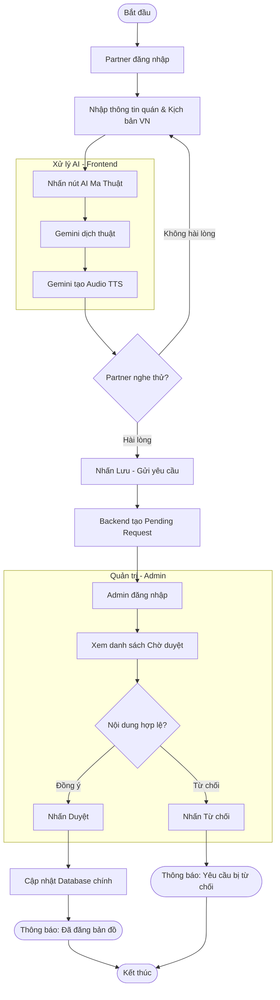

# Sơ đồ Activity Diagram - Quy trình Phê duyệt Thông tin

Sơ đồ này mô tả luồng hoạt động chi tiết từ khi Partner tạo nội dung cho đến khi nội dung đó được hiển thị công khai.

## 1. Sơ đồ Activity Diagram

## 2. Các điểm quyết định (Decision Points)
1.  **Hài lòng?**: Partner có quyền xem trước kết quả AI tạo ra trước khi gửi cho Admin. Điều này giúp giảm thiểu các yêu cầu sai sót.
2.  **Nội dung hợp lệ?**: Admin kiểm tra tính xác thực của hình ảnh, tọa độ và ngôn ngữ để đảm bảo chất lượng dữ liệu trên bản đồ.

## 3. Kết quả cuối cùng
*   Nếu **Đồng ý**: Quán ăn sẽ xuất hiện trên bản đồ cho tất cả người dùng xem.
*   Nếu **Từ chối**: Partner cần xem lại lý do và thực hiện gửi lại yêu cầu mới.
