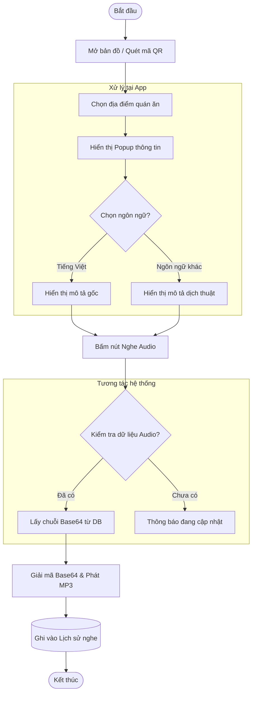
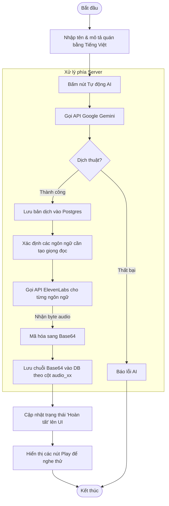

# Activity Diagram: VoiceMap SaaS System

Tài liệu này mô tả các hoạt động logic chính của hệ thống, thể hiện sự tương tác giữa **Frontend**, **Backend API**, **Cơ sở dữ liệu** và các **Dịch vụ AI bên thứ ba**.

## 1. Biểu đồ Hoạt động: Thuyết minh đa ngôn ngữ (User Flow)

Quy trình người dùng tiếp cận thông tin và nghe audio tại chỗ.

---

## 2. Biểu đồ Hoạt động: Quy trình AI tự động (Admin/Owner Flow)

Đây là quy trình phức tạp nhất thể hiện sức mạnh của AI trong việc tự động hóa nội dung.

---

## 3. Giải thích các nút thắt logic (Decisions)

### 3.1. Phân quyền và Giới hạn (RBAC)
*   **Kiểm tra Gói cước:** Trước khi lưu quán mới (`add_restaurant`), Backend kiểm tra số lượng POI hiện có của Chủ quán so với `poi_limit` trong gói đăng ký.
*   **Giới hạn Ngôn ngữ:** Danh sách ngôn ngữ trong `SelectLang` được lọc dựa trên mảng `allowed_langs` thuộc gói dịch vụ mà Owner đang trả phí.

### 3.2. Xử lý Audio (Base64 vs File)
*   Hệ thống không lưu file vật lý `.mp3` để giảm tải quản lý file.
*   Dữ liệu được chuyển đổi thành **Base64 String** trong Backend và lưu trực tiếp vào các cột Text của Database. 
*   Frontend sử dụng tiền tố `data:audio/mp3;base64,` để phát âm thanh trực tiếp từ chuỗi này.

### 3.3. Tối ưu hóa AI
*   Khi chạy AI, hệ thống cập nhật State cục bộ tại Frontend ngay khi nhận được bản dịch để người dùng không phải chờ đợi lâu, trong khi việc tạo Audio (TTS) được xử lý tuần tự phía sau.
