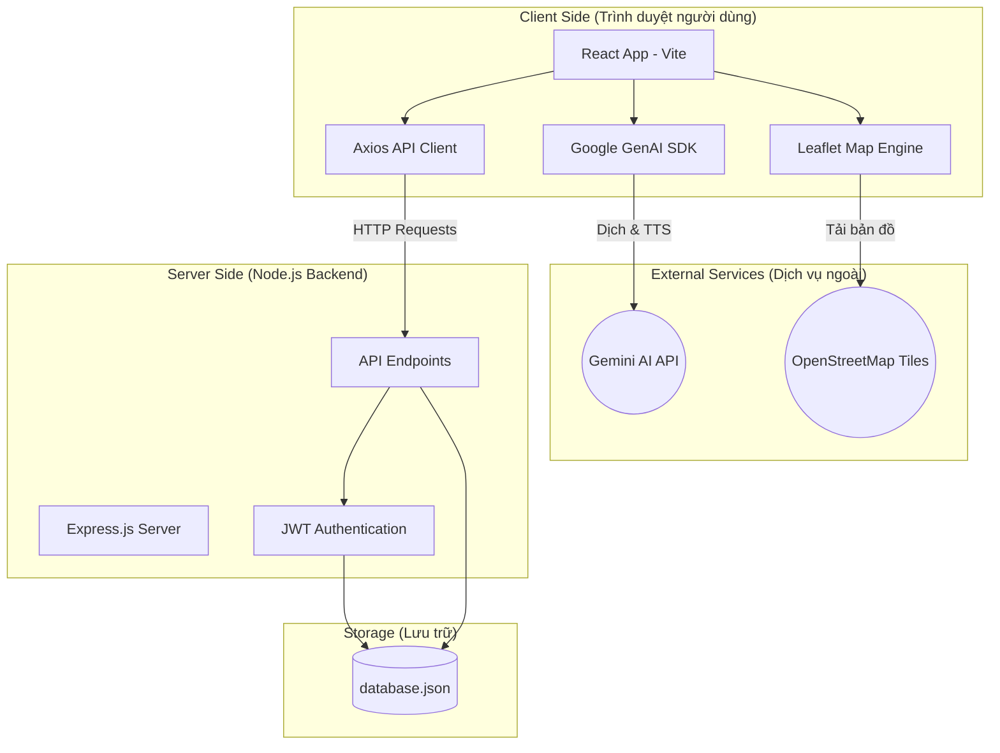

# Sơ đồ Architecture Diagram - Kiến trúc Hệ thống

Sơ đồ này mô tả cấu trúc các thành phần kỹ thuật và cách chúng giao tiếp với nhau trong ứng dụng Food Map AI.

## 1. Sơ đồ Kiến trúc (System Architecture)

## 2. Các thành phần chính

### 2.1. Frontend (React)
*   Sử dụng **Vite** để tối ưu tốc độ phát triển.
*   **Leaflet** đảm nhận việc hiển thị bản đồ tương tác.
*   **Google GenAI SDK** được tích hợp trực tiếp ở Frontend để xử lý các tác vụ AI (Dịch thuật, TTS) nhằm tận dụng tài nguyên máy khách.

### 2.2. Backend (Express)
*   Đóng vai trò là một **RESTful API**.
*   **JWT (JSON Web Token)**: Bảo mật các đầu cuối (endpoints) quan trọng như thêm/sửa/xóa dữ liệu.
*   **File System (fs)**: Sử dụng để đọc/ghi trực tiếp vào tệp JSON, phù hợp cho các ứng dụng quy mô vừa và nhỏ hoặc demo.

### 2.3. External Services
*   **Gemini AI**: Cung cấp khả năng hiểu ngôn ngữ và chuyển đổi văn bản thành giọng nói chất lượng cao.
*   **OpenStreetMap**: Cung cấp dữ liệu bản đồ nền miễn phí.
