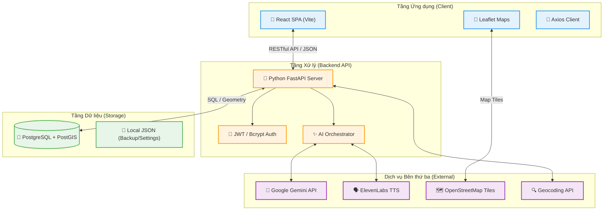

# Architectural Diagram: VoiceMap SaaS Ecosystem

Tài liệu này mô tả kiến trúc tổng thể của hệ thống VoiceMap, thể hiện cách các thành phần giao tiếp với nhau để cung cấp trải nghiệm thuyết minh bản đồ dựa trên AI.

## 1. Sơ đồ Kiến trúc Tổng quát (System Architecture)

---

## 2. Chi tiết các thành phần (Component Details)

### 2.1. Client Layer (Frontend)
*   **React (Vite):** Đảm nhận việc render giao diện người dùng nhanh chóng, quản lý trạng thái (State Management) cho các tab Admin và Bản đồ.
*   **Leaflet.js:** Linh hồn của ứng dụng, xử lý hiển thị Marker, Popup và tương tác không gian (Click để lấy tọa độ).
*   **Tailwind CSS / Custom CSS:** Tạo giao diện Responsive và hiệu ứng cho các dashboard admin.

### 2.2. API Layer (Backend)
*   **Python FastAPI:** Lựa chọn vì tốc độ xử lý nhanh, hỗ trợ async/await tốt cho việc gọi nhiều API AI cùng lúc.
*   **JWT Authentication:** Đảm bảo an ninh, phân quyền giữa **User** (người nghe), **Owner** (người mua gói) và **Admin** (người điều hành).
*   **AI Orchestrator:** Module chịu trách nhiệm trung chuyển dữ liệu từ người dùng gửi lên sang các bộ não AI (Gemini/ElevenLabs) và xử lý dữ liệu trước khi lưu vào DB.

### 2.3. Data Layer (Database)
*   **PostgreSQL:** Cơ sở dữ liệu quan hệ mạnh mẽ, lưu trữ thông tin người dùng, lịch sử và đăng ký gói cước.
*   **PostGIS Extension:** Thành phần cực kỳ quan trọng giúp xử lý dữ liệu vị trí (`Point`), cho phép tính toán khoảng cách và tìm kiếm địa điểm chính xác theo tọa độ.
*   **Base64 Integration:** Âm thanh MP3 được lưu dưới dạng chuỗi Base64 ngay trong các cột của bảng `restaurants`, giúp hệ thống gọn nhẹ và không cần quản lý storage file phức tạp.

### 2.4. External Integration (Cloud Services)
*   **Google Gemini (Flash 1.5/2.0):** Xử lý dịch thuật kịch bản sang 15+ ngôn ngữ một cách tự nhiên.
*   **ElevenLabs:** Cung cấp giọng đọc AI chất lượng cao (Multilingual v2), hỗ trợ tốt tông giọng Việt Nam và quốc tế.
*   **OpenStreetMap:** Cung cấp lớp nền bản đồ (Tiles) hoàn toàn miễn phí và mã nguồn mở.

---

## 3. Luồng dữ liệu (Data Flow)
1.  **Request:** Người dùng yêu cầu tạo AI cho quán.
2.  **Processing:** Backend gửi text sang Gemini để dịch -> Nhận JSON bản dịch -> Gửi text từng ngôn ngữ sang ElevenLabs -> Nhận Byte Audio -> Convert sang Base64.
3.  **Persistence:** Lưu tất cả (Bản dịch + Base64) vào một bản ghi duy nhất trong Postgres.
4.  **Delivery:** Khi người dùng mở bản đồ, chuỗi Base64 được tải xuống và phát trực tiếp trên trình duyệt.
