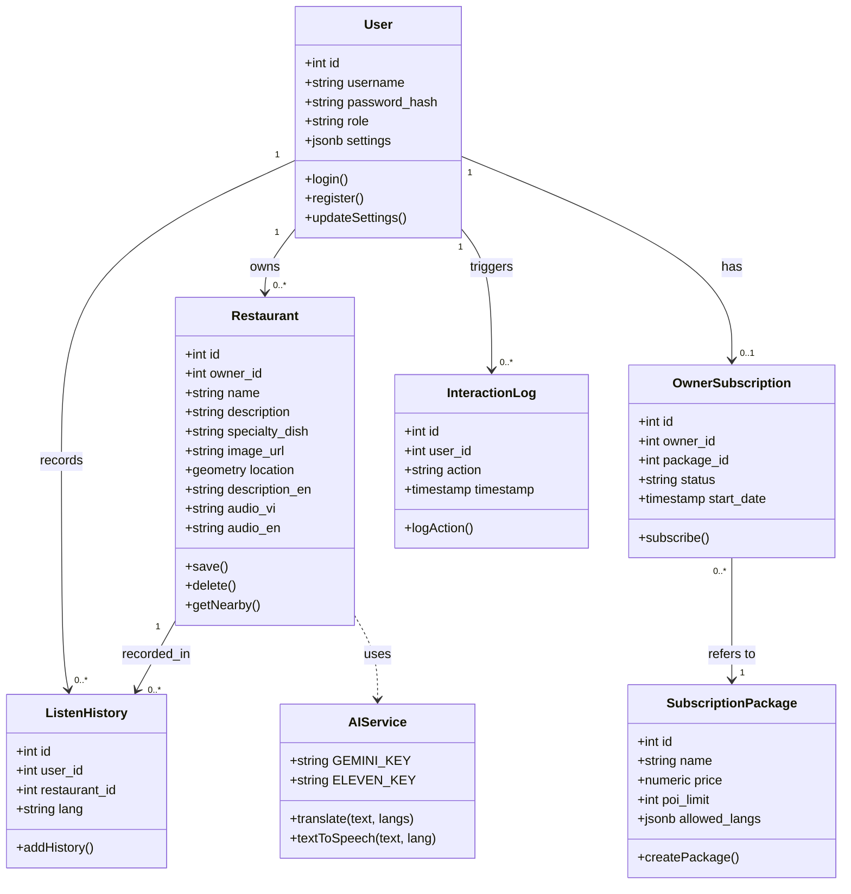

# Class Diagram: VoiceMap SaaS System

Tài liệu này mô tả cấu trúc các lớp (classes) và các thực thể dữ liệu (entities) trong hệ thống, bao gồm các thuộc tính và phương thức xử lý chính.

## 1. Biểu đồ Lớp (Class Diagram - Mermaid)

---

## 2. Mô tả các Lớp chính (Detailed Class Descriptions)

### 2.1. User (Người dùng)
*   **Vai trò:** Quản lý thông tin tài khoản và phân quyền.
*   **Thuộc tính quan trọng:** `role` (xác định là Admin, Owner hay User) và `settings` (lưu cấu hình cá nhân dạng JSON).
*   **Phương thức:** Xử lý các tác vụ Authentication và phân quyền truy cập.

### 2.2. Restaurant (Quán ăn / POI)
*   **Vai trò:** Đại diện cho một địa điểm trên bản đồ.
*   **Thuộc tính không gian:** `location` sử dụng PostGIS để lưu trữ tọa độ thực.
*   **Thuộc tính đa phương tiện:** Chứa các cột text cho mô tả đa ngôn ngữ và chuỗi Base64 cho âm thanh.

### 2.3. AIService (Dịch vụ Trí tuệ nhân tạo)
*   **Vai trò:** Một lớp logic (Service Layer) điều phối các cuộc gọi API ra bên ngoài.
*   **Phương thức `translate`:** Giao tiếp với Google Gemini để nhận bản dịch JSON.
*   **Phương thức `textToSpeech`:** Giao tiếp với ElevenLabs để nhận dữ liệu âm thanh byte và chuyển đổi sang Base64.

### 2.4. Subscription System (Gói cước & Đăng ký)
*   **SubscriptionPackage:** Định nghĩa "khung" quyền lợi (ví dụ: Gói VIP được 10 quán, gói Thường được 1 quán).
*   **OwnerSubscription:** Liên kết giữa một `User` cụ thể với một `Package` nhất định, có hiệu lực dựa trên `status` và `start_date`.

### 2.5. Analytical Entities (Thống kê & Truy vết)
*   **InteractionLog:** Ghi lại mọi biến động hệ thống (Admin đổi gói, Owner xóa quán).
*   **ListenHistory:** Tập trung vào hành vi người dùng cuối (User), lưu lại ngôn ngữ họ ưu tiên nghe tại những địa điểm nào.

---

## 3. Mối quan hệ giữa các Lớp (Class Relationships)
*   **Ownership (1:N):** Một Chủ quán (`User`) quản lý nhiều `Restaurant`.
*   **Dependency:** Lớp `Restaurant` phụ thuộc vào `AIService` để hoàn thiện các dữ liệu thuyết minh đa ngôn ngữ.
*   **Association:** `ListenHistory` đóng vai trò là một lớp liên kết (Association Class) kết nối thông tin giữa `User`, `Restaurant` và ngôn ngữ cụ thể.
