# Entity Relationship Diagram (ERD): VoiceMap SaaS

Tài liệu này mô tả cấu trúc dữ liệu và mối quan hệ giữa các bảng trong hệ thống dựa trên truy vấn SQL của bạn.

## 1. Biểu đồ ERD (Mermaid)

```mermaid
erDiagram
    USERS ||--o{ RESTAURANTS : "owns"
    USERS ||--o{ PARTNERS : "is_assigned"
    USERS ||--o{ INTERACTION_LOGS : "triggers"
    USERS ||--o{ OWNER_SUBSCRIPTIONS : "subscribes_to"
    USERS ||--o{ LISTEN_HISTORY : "listens_to"
    
    RESTAURANTS ||--o{ PARTNERS : "associated_with"
    RESTAURANTS ||--o{ LISTEN_HISTORY : "is_recorded_in"
    
    SUBSCRIPTION_PACKAGES ||--o{ OWNER_SUBSCRIPTIONS : "defined_by"

    USERS {
        int id PK
        string username
        string password_hash
        string role
        jsonb settings
    }

    RESTAURANTS {
        int id PK
        int owner_id FK
        string name
        text description
        string specialty_dish
        string image_url
        geometry location
        text description_languages
        text audio_languages
        int radius_m
        string status
        string category
        text qr_data
    }

    PARTNERS {
        int id PK
        int user_id FK
        int poi_id FK
        string name
        text description
        string status
        text intro_media_url
    }

    INTERACTION_LOGS {
        int id PK
        int user_id FK
        string action
        string target_type
        int target_id
        timestamp timestamp
    }

    SUBSCRIPTION_PACKAGES {
        int id PK
        string name
        numeric price
        text description
        jsonb features
        int duration_days
        int poi_limit
        jsonb allowed_langs
    }

    OWNER_SUBSCRIPTIONS {
        int id PK
        int owner_id FK
        int package_id FK
        string status
        timestamp start_date
    }

    LISTEN_HISTORY {
        int id PK
        int user_id FK
        int restaurant_id FK
        string lang
        timestamp listened_at
    }
```

---

## 2. Giải thích các mối quan hệ (Relationships)

### 2.1. Quản lý Người dùng & Sở hữu
*   **USERS -- RESTAURANTS (1:N):** Một người dùng (Owner) có thể sở hữu nhiều nhà hàng, nhưng mỗi nhà hàng chỉ thuộc về một chủ sở hữu duy nhất.
*   **USERS -- OWNER_SUBSCRIPTIONS (1:N):** Một chủ sở hữu có thể có lịch sử nhiều lượt đăng ký gói cước, nhưng tại một thời điểm thường chỉ có một gói `active`.

### 2.2. SaaS & Gói cước (Subscription)
*   **SUBSCRIPTION_PACKAGES -- OWNER_SUBSCRIPTIONS (1:N):** Một gói cước (Basic, Pro, Enterprise) có thể được đăng ký bởi nhiều chủ sở hữu khác nhau.

### 2.3. Tương tác & Lịch sử
*   **USERS -- LISTEN_HISTORY (1:N):** Lưu lại dấu chân của người dùng khi nghe audio. Liên kết trực tiếp giữa Người dùng - Nhà hàng - Ngôn ngữ.
*   **RESTAURANTS -- LISTEN_HISTORY (1:N):** Giúp thống kê xem nhà hàng nào được nghe nhiều nhất và bằng ngôn ngữ nào.

### 2.4. Đối tác & Vận hành
*   **USERS -- PARTNERS -- RESTAURANTS:** Bảng `PARTNERS` đóng vai trò là bảng trung gian hoặc mở rộng, cho phép gán một User cụ thể vào quản lý một POI (`poi_id`) nhất định với các thông tin bổ sung.

### 2.5. Giám sát (Monitoring)
*   **USERS -- INTERACTION_LOGS (1:N):** Mọi hành động của bất kỳ User nào (Admin, Owner) đều được ghi lại để phục vụ bảo mật và truy vết lỗi.

---

## 3. Lưu ý về kiểu dữ liệu đặc biệt
*   **Geometry:** Cột `location` trong bảng `RESTAURANTS` sử dụng kiểu dữ liệu không gian (PostGIS) để lưu tọa độ kinh độ/vĩ độ, hỗ trợ các truy vấn tìm kiếm "xung quanh đây" hiệu quả.
*   **JSONB:** Sử dụng trong `settings`, `features`, và `allowed_langs` để lưu cấu hình linh hoạt mà không cần thay đổi cấu trúc bảng khi thêm tính năng mới.
