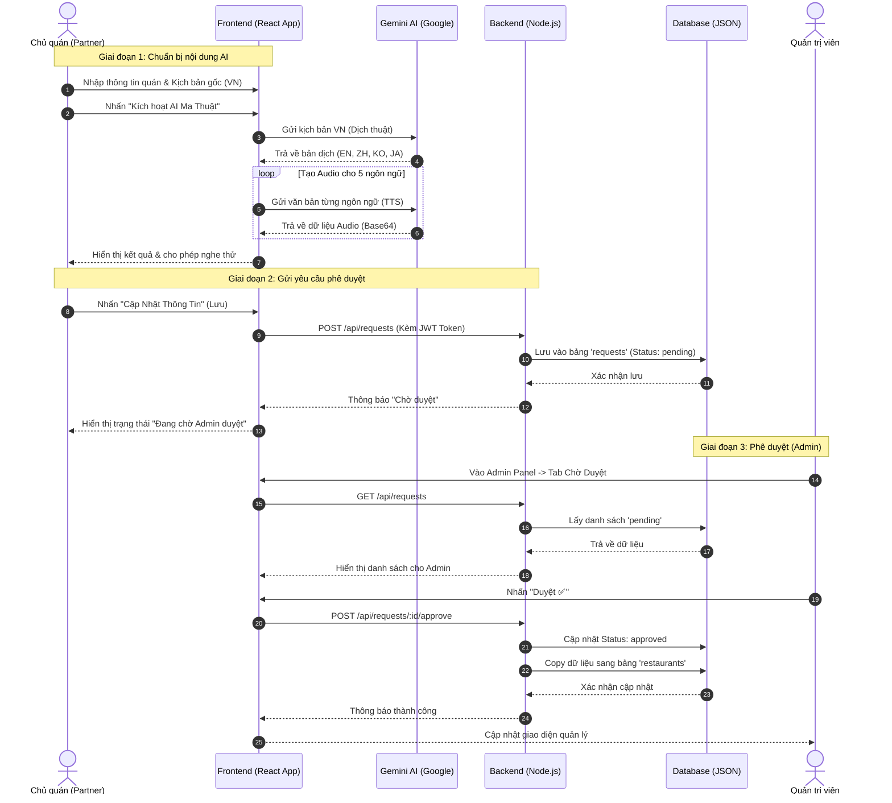

# Sơ đồ Sequence Diagram - Luồng Công Việc Đối Tác (Partner)

Tài liệu này mô tả chi tiết quy trình từ lúc Chủ quán (Partner) nhập liệu, sử dụng AI cho đến khi được Admin phê duyệt.

## 1. Sơ đồ Sequence Diagram

## 2. Giải thích các bước quan trọng

1.  **Xử lý AI tại Frontend (Bước 3-8):** Để giảm tải cho Server và tận dụng API Key của người dùng, việc dịch và tạo Audio được thực hiện trực tiếp từ trình duyệt gọi đến Gemini API.
2.  **Cơ chế "Pending" (Bước 11):** Dữ liệu không ghi đè trực tiếp vào bản đồ công cộng mà nằm ở bảng trung gian `requests`. Điều này đảm bảo an ninh nội dung.
3.  **Chuyển đổi dữ liệu (Bước 21):** Khi Admin duyệt, hệ thống thực hiện thao tác "Atomic": vừa đánh dấu yêu cầu đã xong, vừa cập nhật/tạo mới bản ghi trong danh sách quán ăn chính thức.

## 3. Công cụ hỗ trợ
Bạn có thể copy đoạn mã trên vào:
*   [Mermaid Live Editor](https://mermaid.live/) để xuất ra file ảnh (PNG/SVG).
*   Các plugin Mermaid trên VS Code hoặc Notion để hiển thị trực tiếp.
