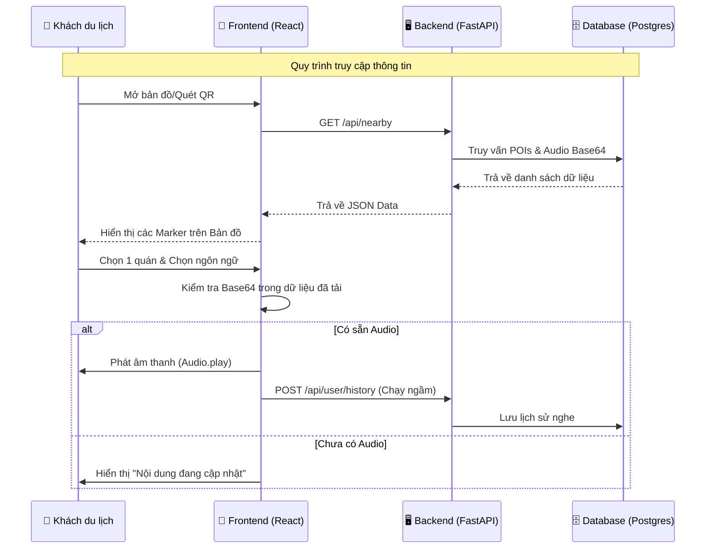
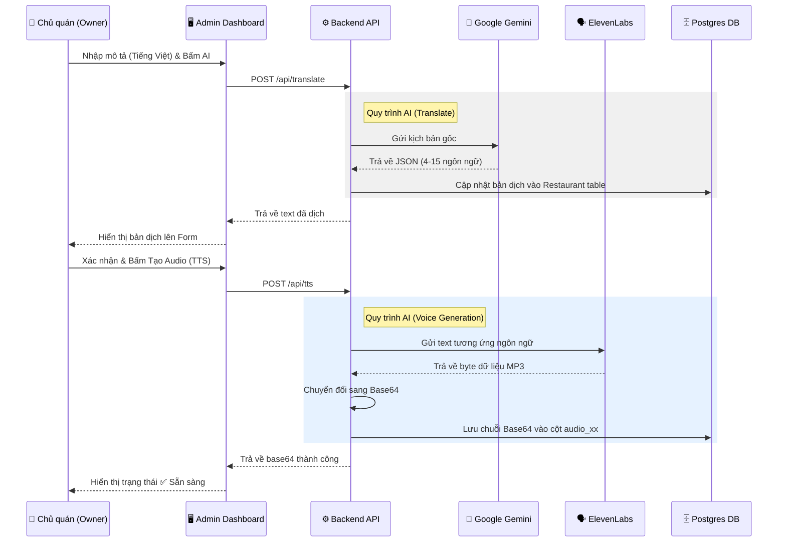
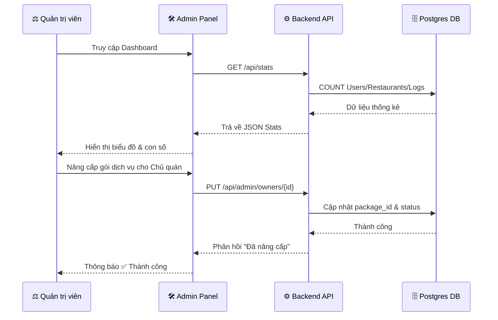

# Sequence Diagrams: VoiceMap SaaS Interaction

Tài liệu này mô tả trình tự tương tác giữa các tác nhân (Actors) và các thành phần của hệ thống (Frontend, Backend, Database, Cloud AI).

## 1. Trình tự: Người dùng nghe thuyết minh (User Flow)
Mô tả cách một khách du lịch tương tác với bản đồ để nghe thuyết minh đa ngôn ngữ.

---

## 2. Trình tự: Chủ quán tạo nội dung bằng AI (Owner AI Flow)
Mô tả quy trình chủ quán sử dụng sức mạnh của Gemini và ElevenLabs để tự động hóa kịch bản.

---

## 3. Trình tự: Quản trị viên điều hành hệ thống (Admin Flow)
Mô tả cách Admin quản lý gói cước và giám sát hoạt động.

---

## 4. Ghi chú kỹ thuật
*   **Tính đồng bộ:** Quy trình dịch thuật (Translate) diễn ra đồng bộ để Owner thấy kết quả ngay.
*   **Tính bất đồng bộ (giả lập):** Luồng Audio được khuyến khích chạy từng ngôn ngữ để tránh Timeout API.
*   **Bảo mật:** Mọi request từ API đến DB đều được mã hóa và các API AI được bảo vệ bởi Key lưu tại biến môi trường Backend.
