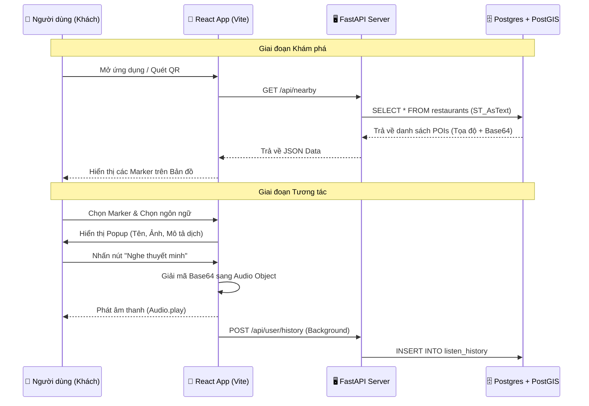
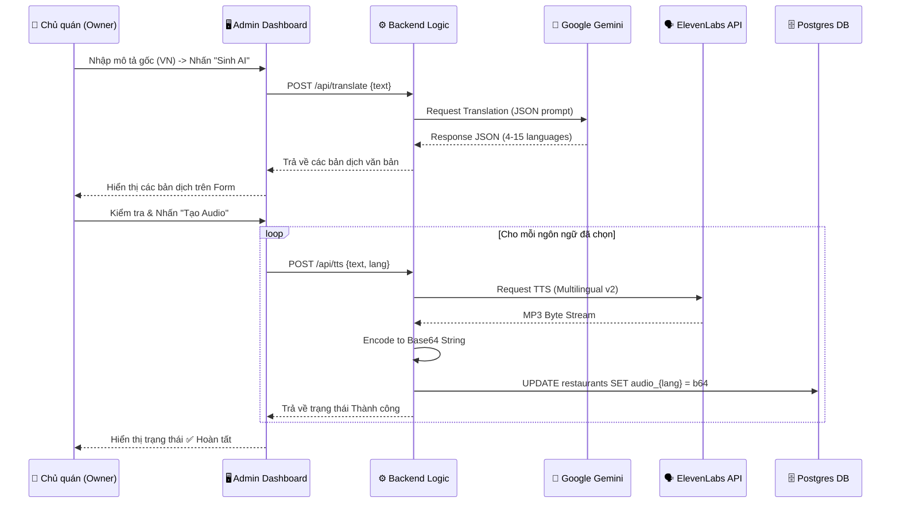
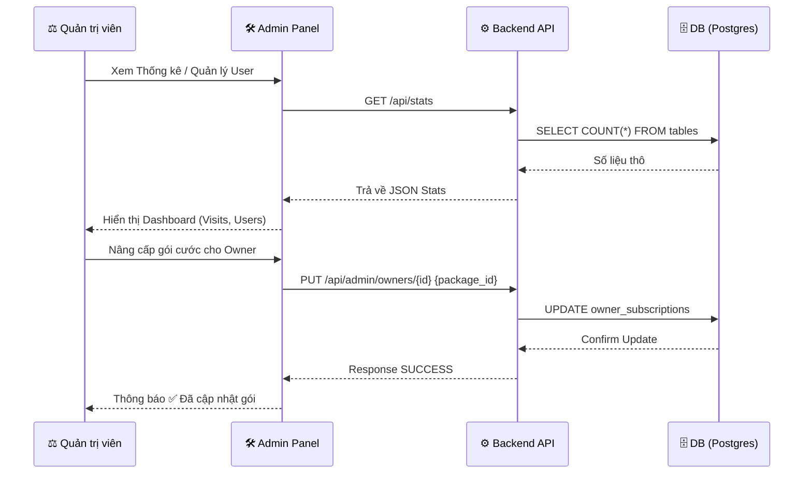

# Sequence Diagram: VoiceMap SaaS Interaction Flow

Tài liệu này mô tả trình tự tương tác (Sequence) giữa các thành phần trong hệ thống phục vụ cho các nghiệp vụ cốt lõi.

## 1. Luồng Người dùng: Khám phá & Nghe Thuyết minh (User Flow)

Mô tả cách một khách du lịch tương tác với bản đồ và nhận phản hồi âm thanh từ hệ thống.

---

## 2. Luồng Chủ quán: Tạo nội dung AI (Owner AI Workflow)

Mô tả quy trình tự động hóa kịch bản đa ngôn ngữ bằng AI.

---

## 3. Luồng Quản trị: Quản lý Dashboard & Phân quyền (Admin Flow)

---

## 4. Đặc điểm Kỹ thuật của Trình tự
*   **Decoupling:** Hệ thống tách biệt luồng Dịch (Translate) và luồng Giọng nói (TTS) để Owner có thể điều chỉnh văn bản trước khi sinh âm thanh (tiết kiệm chi phí API).
*   **Base64 Delivery:** Âm thanh không được tải như một file độc lập mà được đính kèm trong payload JSON của POI, giúp giảm số lượng request HTTP khi người dùng khám phá bản đồ.
*   **Asynchronous Logging:** Việc ghi lại lịch sử nghe của người dùng được thực hiện bất đồng bộ (Background process) để không làm gián đoạn trải nghiệm nghe của khách du lịch.
