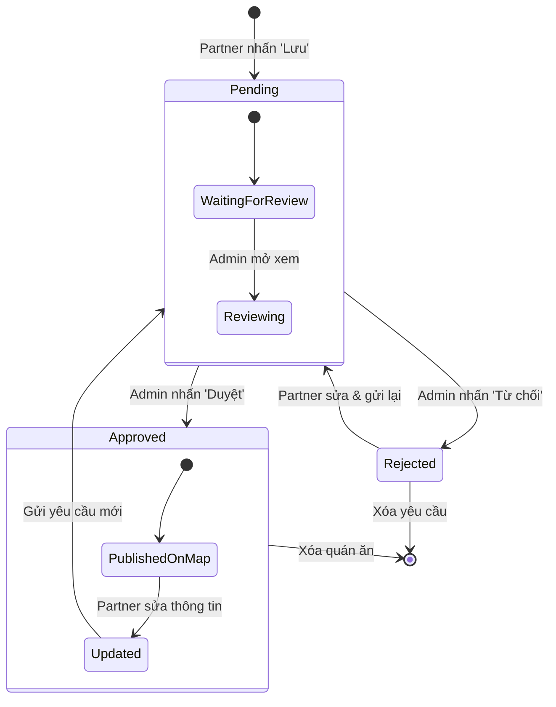

# Sơ đồ State Machine Diagram - Trạng thái của Yêu cầu (Request)

Sơ đồ này mô tả vòng đời của một yêu cầu phê duyệt thông tin quán ăn từ lúc được tạo ra cho đến khi kết thúc.

## 1. Sơ đồ Trạng thái (State Machine)

## 2. Giải thích các trạng thái

*   **Pending (Chờ duyệt):** Trạng thái mặc định khi Partner gửi thông tin mới. Lúc này quán ăn chưa xuất hiện trên bản đồ chính thức.
*   **Approved (Đã duyệt):** Admin đã xác nhận nội dung. Hệ thống tự động sao chép dữ liệu sang danh sách quán ăn chính thức và hiển thị lên bản đồ.
*   **Rejected (Bị từ chối):** Nội dung không đạt yêu cầu. Partner cần chỉnh sửa lại để gửi yêu cầu mới.
*   **Updated (Đã cập nhật):** Khi một quán đã được duyệt nhưng Partner muốn thay đổi thông tin, hệ thống sẽ đưa về quy trình phê duyệt lại để đảm bảo tính nhất quán.

## 3. Các sự kiện chuyển đổi (Transitions)
*   **Submit**: Chuyển từ khởi tạo sang Pending.
*   **Approve**: Chuyển từ Pending sang Approved (Kích hoạt dữ liệu).
*   **Reject**: Chuyển từ Pending sang Rejected (Yêu cầu sửa đổi).
*   **Edit**: Chuyển từ Approved/Rejected quay lại luồng chỉnh sửa để trở về Pending.
