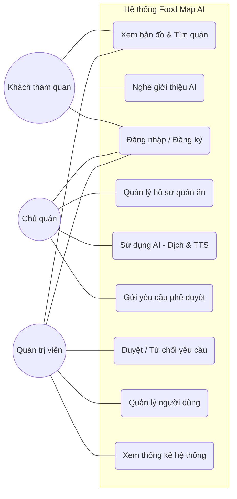

# Sơ đồ Use Case Diagram - Hệ thống Bản đồ Thực phẩm AI

Sơ đồ này mô tả các chức năng chính của hệ thống và sự tương tác của các nhóm người dùng khác nhau.

## 1. Sơ đồ Use Case

## 2. Mô tả các Tác nhân (Actors)

*   **Khách tham quan (Guest):** Người dùng cuối, sử dụng ứng dụng để tìm kiếm địa điểm ăn uống và nghe thuyết minh bằng ngôn ngữ của họ.
*   **Chủ quán (Partner):** Đối tác cung cấp dữ liệu, có quyền quản lý thông tin quán của mình nhưng cần thông qua kiểm duyệt.
*   **Quản trị viên (Admin):** Người kiểm soát toàn bộ hệ thống, phê duyệt nội dung và quản lý tài khoản.

## 3. Các mối quan hệ chính
*   **Partner & AI:** Partner là người duy nhất kích hoạt chức năng AI để tạo nội dung đa phương tiện cho quán của mình.
*   **Admin & Partner:** Admin đóng vai trò "người gác cổng" cho các yêu cầu mà Partner gửi lên.
